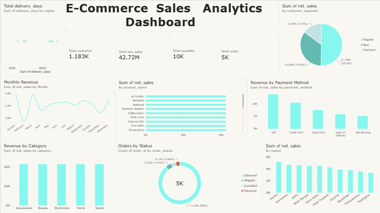

# 📊 E-Commerce Sales Analytics

An end-to-end data analytics project using **MySQL, SQL, and Power BI** to analyze e-commerce sales performance and generate business insights.

## 🎯 Project Overview

This project analyzes e-commerce data across customers, products, orders, and payments.

The workflow covers data analysis using SQL and presents the final business insights through an interactive Power BI dashboard.

### 🔄 Project Workflow

Raw Data → MySQL → SQL Analysis → Power BI → Dashboard

---

## 🛠️ Tools & Technologies

- **MySQL**
- **SQL**
- **Power BI**
- **DAX**
- **Power Query**
- **Data Cleaning**
- **Data Visualization**

---

## 📂 Dataset

The project contains data related to:

- Customers
- Products
- Orders
- Payments

---

## 🔎 SQL Analysis

SQL was used to analyze:

- Total Revenue
- Total Profit
- Total Orders
- Units Sold
- Average Order Value
- Monthly Sales
- Sales by Region
- Sales by Category
- Payment Method Performance
- Order Status
- Top Products
- Top Customers
- Customer Repeat Purchase Behavior
- Discount Impact on Profit
- Product Profitability

SQL views were also created for:

- Sales Summary
- Product Performance
- Customer Performance

---

## 📊 Power BI Dashboard

The Power BI dashboard includes:

- 💰 Total Revenue
- 📈 Total Profit
- 🛒 Total Orders
- 👥 Total Customers
- 📦 Units Sold
- 📅 Monthly Revenue
- 🌍 Revenue by Region
- 🏷️ Revenue by Category
- 🏆 Top 10 Products
- 📋 Orders by Status
- 💳 Revenue by Payment Method

---

## 🖼️ Dashboard Preview



---

## 📁 Project Structure

```text
E-Commerce-Sales-Analytics/
│
├── README.md
│
├── E-Commerce-Sales-Analytics.pbix
│
├── Dashboard.png
│
└── sql/
    ├── ecommerce_analysis.sql
    └── views.sql
